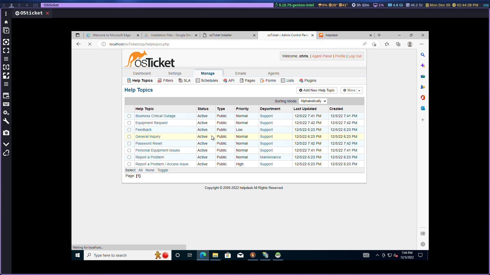

# osTicket - Post-Install Configuration
This tutorial outlines the post-install configuration of the open-source help desk ticketing system osTicket.

## Environments and Technologies Used

- Microsoft Azure (Virtual Machines/Compute)
- Remote Desktop
- Internet Information Services (IIS)

## Operating Systems Used 

- Windows 10 (21H2)

## Post-Install Configuration Objectives

- Configuring roles
- Defining SLAs 2
- Allow anyone to create tickets
- Creating teams
- Creating departments

Now that we have osTicket installed let's configure it for our organization.

## Configure Roles

Admin Panel -> Agents -> Roles then add a new role and assign the proper permissions

- Supreme Admin

## Configure Departments

Admin Panel -> Agents -> Departments

- System Administrators

## Configure Teams

Admin Panel -> Agents -> Teams

- Level I Support
- Level II Support

## Allow anyone to create tickets

- Admin Panel -> Settings -> User Settings
- Registration Required: Require registration and login to create tickets 

## Configure Agents (workers)

Admin Panel -> Agents -> Add New

- Jane
- John

## Configure Users (customers)

Agent Panel -> Users -> Add New

- Karen
- Ken

## Configure SLA

Admin Panel -> Manage -> SLA

- Sev-A (1 hour, 24/7)
- Sev-B (4 hours, 24/7)
- Sev-C (8 hours, business hours)

## Configure Help Topics

Admin Panel -> Manage -> Help Topics

- Business Critical Outage
- Personal Computer Issues
- Equipment Request
- Password Reset

